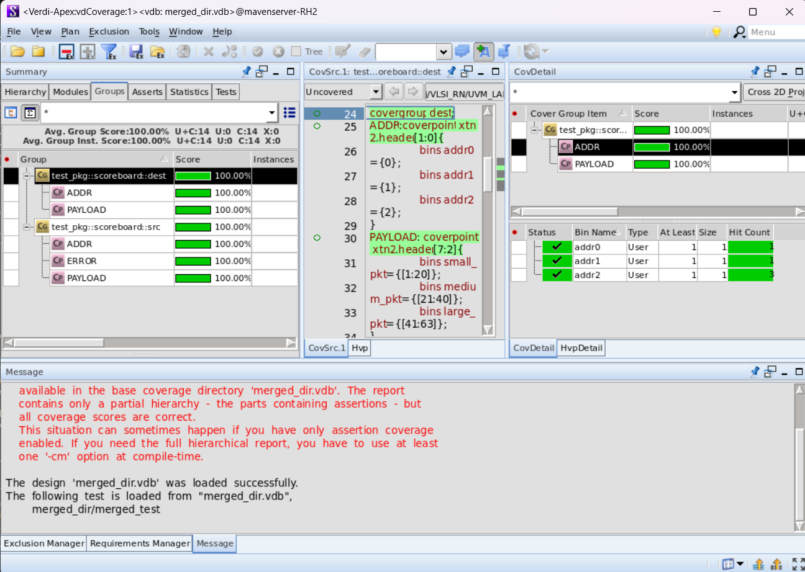
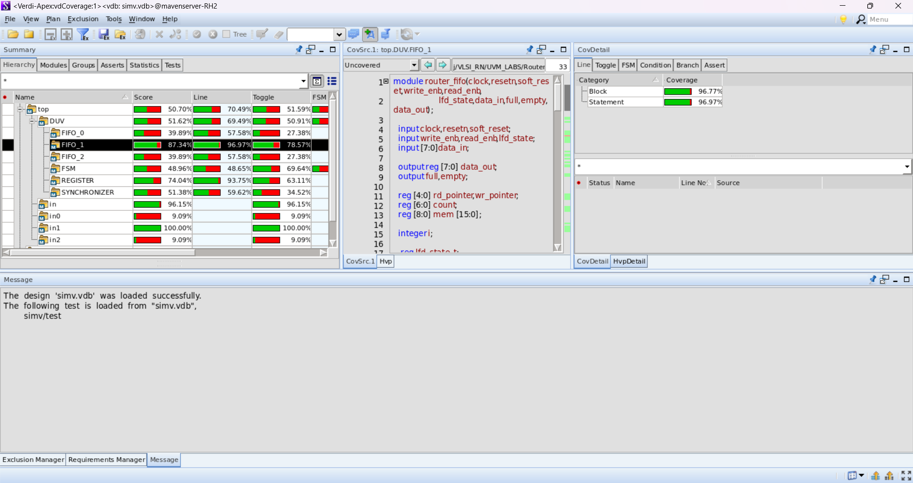
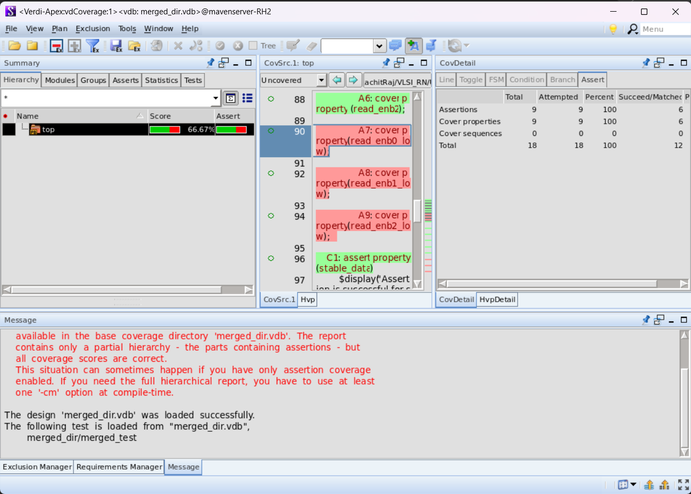

# Router1x3

Designed a 1x3 Router in Verilog, integrating sub-components with Xilinx ISE and verifying RTL quality using Synopsys VC Spyglass. Developed a UVM testbench in SystemVerilog with 1 source and 3 destination agents, achieving **100% functional coverage**, **66.66% assertion pass rate**, and **50% code coverage**. Enhanced accuracy through waveform analysis.

  
**RTL NETLIST GENERATED ON XILINX ISE:**  

  
  

**VERIFCATION USING FUNCTIONAL COVERAGE, CODE COVERAGE AND ASSERTION BASED VERIFICATION USING SYNOPSYS VCS AND VERDI**

